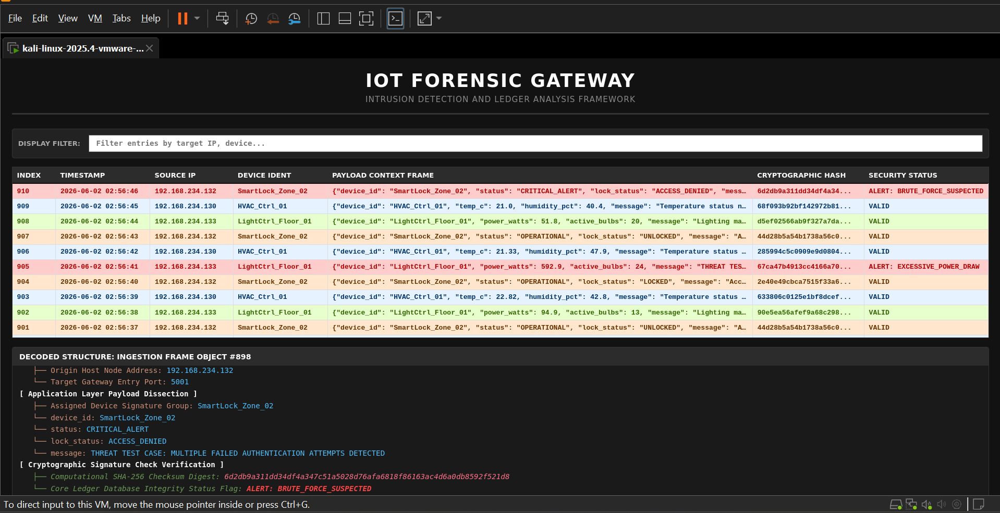

# IoT Forensic Gateway
An automated real-time forensic gateway and predictive network IDS.

## Features
* **Automated real-time packet ingestion**
* **Cryptographic SHA-256 fingerprinting** 
* **Signature-based intrusion detection engine**
* **Persistent relational storage** via SQLite
* **Zero-Trust network validation** philosophy

## Tech Stack
* **Language**: Python (Standard libraries: socket, select, hashlib, sqlite3, http.server)
* **Infrastructure**: Kali Linux (Gateway), Lubuntu VMs (Emulators), VMware Workstation Pro
* **Architecture**: Asynchronous socket multiplexing, AJAX-driven web dashboard

## Demo
[Demo Video](https://drive.google.com/file/d/1GPZUzblg9Xwm6AhDZhawA6TVFSPaagrl/view?usp=sharing)

## Screenshots
### System Interface

## Author
Faaiza Mir | BS Cyber Forensics & Security | Air University Islamabad
